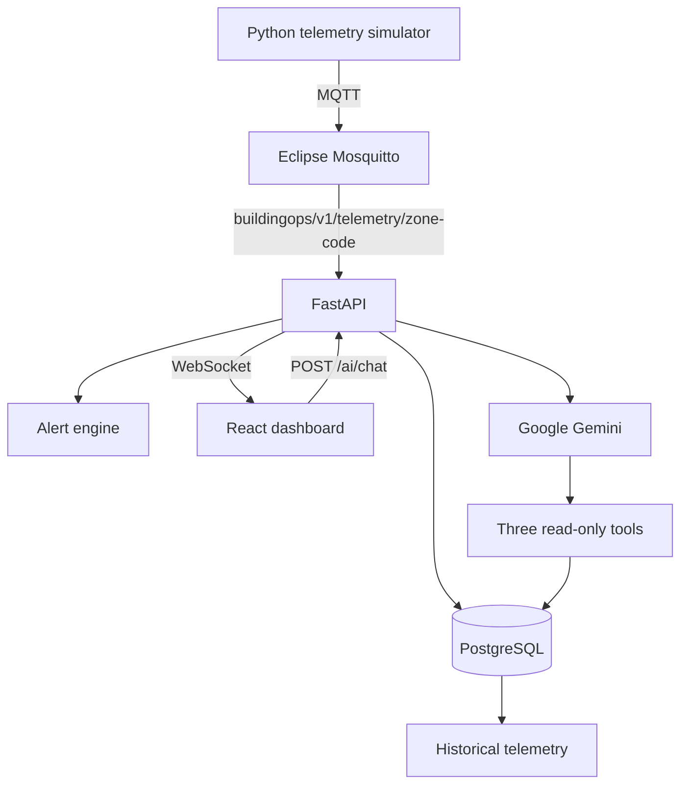

# BuildingOps

BuildingOps is a local-first, simulated smart-building operations platform for a building or facility engineer. It ingests synthetic zone telemetry over MQTT, persists history in PostgreSQL, evaluates operational alerts, streams live updates to a React dashboard, and lets Google Gemini investigate data through three bounded, read-only application tools.

This is an interview and portfolio MVP. Its readings are simulated, it does not control equipment, and it is not a life-safety or production building-management system.

## Problem

Building engineers often need to combine environmental readings, occupancy, HVAC state, power demand, incident history, and time-series data before they can explain what is happening. Disconnected tools slow that investigation and make missing or stale information easy to overlook.

## Solution

BuildingOps presents current and historical conditions for one five-zone demo building in six focused views:

- Building Overview
- Live Zone Monitor
- HVAC Monitoring
- Energy Analytics and Historical Analytics
- Alerts & Incidents
- AI Building Assistant

## Architecture



The backend is the trust boundary. The browser never connects to MQTT, PostgreSQL, or Gemini directly. FastAPI validates MQTT payloads, updates the current in-memory view, queues persistence, evaluates alerts in the persistence transaction, and broadcasts accepted readings to WebSocket clients. HTTP reads from PostgreSQL are authoritative for history and reconnect recovery.

## Key features

- Five-zone demo hierarchy with idempotent seed data
- Stateful synthetic temperature, humidity, CO₂, occupancy, HVAC, and power readings
- MQTT QoS 1 publishing and validated backend ingestion
- PostgreSQL telemetry history managed by Alembic
- Live WebSocket snapshot and telemetry events
- Current HVAC and energy summaries with explicit units
- Per-zone historical temperature, CO₂, occupancy, and power charts
- Persistent active/resolved alerts with hysteresis
- Gemini function calling grounded in bounded BuildingOps queries
- Loading, empty, error, stale-data, disconnect, and provider-failure states

## Tech stack

| Layer | Technology |
|---|---|
| Frontend | React, TypeScript strict mode, Vite, React Router, TanStack Query, Recharts |
| Backend | Python 3.11, FastAPI, Pydantic, SQLAlchemy, Alembic |
| Database | PostgreSQL 16 |
| Messaging | Eclipse Mosquitto, MQTT via paho-mqtt |
| Realtime | FastAPI WebSockets |
| AI | Google Gemini via `google-genai`, manual function calling |
| Testing | pytest, Vitest, Testing Library, mypy, Ruff, ESLint, TypeScript |
| Local infrastructure | Docker Compose for PostgreSQL and Mosquitto |

## Repository structure

```text
backend/                   FastAPI application, migrations, tests, AI tools
frontend/                  React dashboard and component/integration tests
simulator/                 Independent synthetic MQTT publisher
infrastructure/mosquitto/  Local broker configuration
docker-compose.yml         PostgreSQL and Mosquitto
.env.example               Safe local configuration template
AGENTS.md                  Engineering and scope rules
PRD.md                     Product requirements
ARCHITECTURE.md            Implemented architecture and decisions
PLAN.md                    Milestone plan and verification status
```

## AI architecture

The `/ai` screen sends a one-shot question to `POST /ai/chat`. The server gives Gemini an allowlist of exactly three functions:

- `get_current_building_state`
- `get_active_alerts`
- `get_zone_history`

Tool arguments are validated, lookback windows and result counts are capped, automatic SDK tool execution is disabled, and the server performs at most three tool rounds. Tools use SQLAlchemy queries owned by the application; Gemini receives neither SQL access nor database credentials. A response is marked `grounded=true` only after an allowlisted tool is used. The Gemini key stays in the root `.env` and is never exposed through a `VITE_*` variable.

RAG is intentionally absent: the questions concern small, structured, current operational datasets, so function calling provides a simpler and more inspectable grounding boundary.

## Alert rules

The backend currently evaluates these three rules after each persisted reading:

| Rule | Opens | Resolves |
|---|---:|---:|
| High CO₂ | `co2_ppm >= 1200` | `co2_ppm < 1000` |
| High Temperature | `temperature >= 28°C` | `temperature < 27°C` |
| High Zone Power | `zone_power_kw >= 10 kW` | `zone_power_kw < 9 kW` |

Only one active occurrence may exist for a zone/rule pair. A PostgreSQL partial unique index enforces that invariant, and check constraints reject unknown types, severities, or statuses. Resolved occurrences remain available as history; the UI requests only the 10 most recent resolved rows for demo usability and does not delete data.

## Prerequisites

- Python 3.11
- [uv](https://docs.astral.sh/uv/)
- Node.js 20.19+ or 22.12+ and npm
- Docker Engine/Desktop with the Compose plugin for PostgreSQL and Mosquitto

## Environment variables

Copy `.env.example` to `.env`. The real `.env` is ignored by Git.

| Variable | Purpose |
|---|---|
| `POSTGRES_DB`, `POSTGRES_USER`, `POSTGRES_PASSWORD` | Local Compose database initialization |
| `DATABASE_URL` | SQLAlchemy PostgreSQL connection |
| `MQTT_HOST`, `MQTT_PORT` | Broker address |
| `MQTT_KEEPALIVE_SECONDS`, `MQTT_QOS` | MQTT connection settings |
| `MQTT_USERNAME`, `MQTT_PASSWORD` | Optional broker credentials |
| `BACKEND_URL` | Vite development proxy target |
| `FRONTEND_HOST`, `FRONTEND_PORT` | Vite development server address |
| `GEMINI_API_KEY` | Optional server-side Gemini key |
| `GEMINI_MODEL` | Gemini model name |

`GEMINI_API_KEY` must never be renamed to a `VITE_*` variable. Values prefixed with `VITE_` can be embedded in browser bundles.

## Local setup

From the repository root:

```powershell
Copy-Item .env.example .env
docker compose up -d postgres mosquitto
docker compose ps
```

The example database password is local-development data, not a production credential. Mosquitto permits anonymous local access for this demo only.

Prepare the backend and database:

```powershell
cd backend
uv sync --locked --extra dev --python 3.11
uv run alembic upgrade head
uv run python -m app.seed
```

Prepare the simulator:

```powershell
cd ..\simulator
uv sync --locked --extra dev --python 3.11
```

Prepare the frontend:

```powershell
cd ..\frontend
npm ci
```

## Running the application

Keep PostgreSQL and Mosquitto running, then use three terminals.

Backend:

```powershell
cd backend
uv run uvicorn app.main:app --reload --host 127.0.0.1 --port 8000
```

Simulator:

```powershell
cd simulator
uv run python -m src.main
```

Frontend:

```powershell
cd frontend
npm run dev
```

Open `http://127.0.0.1:5173`. FastAPI health is at `http://127.0.0.1:8000/health`.

The simulator publishes one event per zone every five seconds by default. `SIMULATOR_INTERVAL_SECONDS` can override the cadence. All emitted readings are synthetic.

## API and event contracts

Primary read paths are:

- `GET /health`
- `GET /buildings`
- `GET /buildings/{building_id}/floors`
- `GET /buildings/{building_id}/zones`
- `GET /zones/{zone_id}/devices`
- `GET /telemetry/latest`
- `GET /zones/{zone_id}/telemetry?limit=100`
- `GET /alerts?status=ACTIVE&limit=100`
- `POST /ai/chat`
- `WS /ws/telemetry`

MQTT uses `buildingops/v1/telemetry/{zone_code}`. A WebSocket connection receives a `snapshot` event followed by `telemetry` events. Vite proxies `/buildings`, `/zones`, `/telemetry`, `/alerts`, `/ai`, and WebSocket-enabled `/ws` to the backend during development.

## Testing

Backend:

```powershell
cd backend
uv run ruff check .
uv run ruff format --check .
uv run mypy app
uv run pytest
```

Simulator:

```powershell
cd simulator
uv run ruff check src tests
uv run ruff format --check src tests
uv run mypy src
uv run pytest
```

Frontend:

```powershell
cd frontend
npm run lint
npm run typecheck
npm run test
npm run build
```

Optional live Gemini verification, which consumes provider quota and may be unavailable during a provider outage:

```powershell
cd backend
uv run python scripts/verify_gemini.py
```

The script uses bounded in-memory synthetic fixtures and never prints the API key.

## Example AI questions

- Which zone has the highest CO₂?
- Which zones have active alerts?
- Which zone is using the most power?
- Summarize recent conditions in Server Room.
- Summarize the building right now.

## Engineering decisions

- **MQTT for telemetry:** a lightweight publish/subscribe boundary keeps the simulator independent from backend storage and UI concerns.
- **WebSockets for the live UI:** accepted backend events reach the browser promptly, while HTTP remains the recovery and history path.
- **PostgreSQL for history:** relational constraints, indexed time-series reads, migrations, and persistent alert lifecycles fit the fixed MVP schema.
- **FastAPI:** typed validation and asynchronous lifecycle hooks suit MQTT, WebSocket, REST, and AI adapter boundaries in one modular service.
- **A simulator:** the project remains safe, local, and demonstrable without real building equipment.
- **Alert hysteresis:** separate open and clear thresholds prevent repeated incident flapping near a boundary.
- **TanStack Query:** server-state caching, refetching, and error/loading states stay out of presentation components.
- **Gemini function calling:** structured tools ground operational answers without adding a document retrieval system.
- **Read-only AI tools:** the assistant can investigate but cannot mutate incidents, change setpoints, or control equipment.

## Scope and limitations

- One seeded demo building; no authentication, RBAC, device CRUD, or multi-building management
- Monitoring only; no HVAC or equipment control
- Synthetic readings only; no BACnet/Modbus or real hardware integration
- In-process latest-state store, persistence queue, and WebSocket connection registry
- No durable MQTT event ID, so QoS 1 redelivery can persist a duplicate sample
- The current simulator is a normal stateful random walk; it does not expose named anomaly-scenario selection
- Docker Compose provisions PostgreSQL and Mosquitto; backend, simulator, and frontend run as local processes
- Gemini depends on an external provider and can return a safe unavailable state

To scale beyond one demo building, future work could introduce tenant-aware authorization, broker authentication, durable event identity/buffering, telemetry retention/partitioning, distributed realtime fan-out, and independently scalable ingest workers. Those are design directions, not implemented claims.

## V2 implementation status

V1 M0–M13 remains complete with its recorded verification limitations. **M14 — Buildings Experience Foundation** is implemented. The delivered extension is a read-only Buildings page using existing APIs, static illustrative imagery, and explicit UUID navigation; Dashboard and V1 operational views remain supported. Full scope, acceptance criteria, and tests are in [PLAN.md](PLAN.md); product boundaries are in [PRD.md](PRD.md).

[ARCHITECTURE.md](ARCHITECTURE.md) records the three pre-M14 decisions: authoritative M14 scope, canonical multi-building identity, and history retention. UUIDs identify REST/database resources; the future MQTT topic is `buildingops/v2/telemetry/{building_code}/{floor_number}/{zone_code}` because zone codes are unique only within a floor. Current V1 topics, simulator, APIs, and WebSocket behavior remain unchanged until a separately planned telemetry migration implements temporary dual-version backend support. M14 adds no telemetry routing or schema changes.

Building navigation must validate an explicit route UUID rather than select by demo name or first list item. No hierarchy Delete actions are permitted in M14. Future management normally archives entities with operational history; the first hierarchy-management milestone must migrate and test retention safeguards before exposing mutations. Existing database/ORM cascades are not permission to delete history through UI management.

## Recommended 5-minute demo

1. Explain the simulator → MQTT → FastAPI → PostgreSQL/WebSocket → React architecture.
2. Open Overview and point out five zones, current occupancy, power, and real active-alert count.
3. Open Live Monitor and show timestamps changing with a connected WebSocket status.
4. Open HVAC and compare running/stopped state, setpoints, temperature difference, and HVAC power.
5. Open Energy, explain kW versus energy, then change the Historical Analytics zone selector.
6. Open Alerts and explain active/resolved lifecycle and hysteresis.
7. Open AI Assistant and ask “Which zone has the highest CO₂?”
8. Show the tool/source metadata and explain why Gemini is read-only and server-side.
9. If Gemini is unavailable, show the safe fallback and continue—the monitoring product remains usable.
10. Close with the automated test commands and `ARCHITECTURE.md` tradeoffs.

## Interview talking points

- Hallucination risk is reduced through mandatory tools for operational facts, bounded outputs, server-owned queries, source metadata, and `grounded=false` fallbacks.
- The Gemini key is a server-side secret loaded from ignored `.env`; frontend source and production bundles do not contain it.
- MQTT and WebSocket solve different problems: broker-facing device ingest versus browser-facing application events.
- HTTP/database reads are authoritative because WebSocket delivery is ephemeral.
- The architecture is deliberately a modular monolith: it demonstrates boundaries without introducing unnecessary distributed-system operations.

## Buildings experience (M14)

Open **Buildings** or visit `/buildings`. Cards load the existing list and two cached hierarchy queries per building (floors/zones); no device or telemetry fan-out. Total Buildings is the only portfolio total. Unavailable hierarchy counts are labeled and can be retried; operational status remains unavailable rather than inferring health from legacy telemetry. Local illustrative photos use deterministic code mapping and a generic photo for unknown codes, with SVG and text error fallbacks.

View Building opens `/buildings/{UUID}`. M15 now provides the building header, shared imagery, hierarchy counts, and nested floors, zones, and device lists. The destination validates UUID syntax and parent relationships, handles 404/errors without selecting another building, and supports return navigation. Browser reloads receive the Vite HTML shell while API requests remain proxied. Production hosts must likewise route HTML navigation to the SPA and API requests to FastAPI.

V1 views stay in the unique `DEMO-BLDG-01` context; missing or ambiguous demo codes yield the existing empty state. No name or list position selects the demo. The V1 Dashboard layout, legacy telemetry aggregation, alerts, and AI context remain unchanged; portfolio telemetry attribution awaits the future V2 transport migration. See [M14 verification](docs/M14_VERIFICATION.md).

## Building Details (M15)

`npm run test` runs the complete frontend suite with at most two workers to avoid resource contention and async UI timeouts on local Windows machines. No tests or assertions are disabled.

Building Details reuses `getBuilding`, `listFloors`, `listZones`, and `listDevices`. TanStack Query caches floors/zones per building UUID and devices per zone UUID; device lists are fetched once per zone and supply both the nested list and total. Invalid parent responses stay unavailable. Each floor groups its zones; each zone lists device identifiers, names, and types. No telemetry attribution or operational health is inferred.

Floor links use `/buildings/:buildingId/floors/:floorId`; zone links use the single canonical `/zones/:zoneId` route. M15 originally provided destination shells; M16 now provides the operational detail pages below. Vite supports HTML reloads under both `/buildings` and `/zones`. See [M15 verification](docs/M15_VERIFICATION.md).

## Floor & Zone Details (M16)

Floor Details validates building/floor UUIDs and membership, shows only the selected floor's zones and devices, and presents current conditions plus scoped read-only active alerts. Zone Details uses the existing `GET /zones/{zone_id}` endpoint, validates its UUID, and independently resolves its parent floor/building from cached building/floor reads. No route history or display name selects context. This parent discovery requires the building list and one cached floor list per building because the zone response contains only `floor_id`; no aggregation endpoint was introduced.

The existing TelemetryProvider supplies initial REST readings, snapshots, and subsequent WebSocket updates. M16 creates no separate latest-state store or socket. Legacy code-keyed readings are shown only for the unique `DEMO-BLDG-01` context and a unique matching zone code in its complete hierarchy; additional-building readings remain unavailable pending the future V2 migration. Status priority is Alert, Live, Stale, then No telemetry. Live means a valid source timestamp no older than 30 seconds, reevaluated every five seconds; it does not claim individual device connectivity. No existing freshness threshold was present. Missing sensor values display dashes and timestamps come from the reading.

Current Conditions, HVAC, configured devices, and active alerts have independent loading/error/retry/empty states. Alerts reuse the existing seven-second polling query and latest-100 bound; saturated responses are labeled potentially incomplete and do not prove absence. Device links use `/devices/:deviceId`, where `deviceId` is the database UUID, not the human-readable `device_id`. M16 provided the navigation foundation; M17 now provides Device Details below. See [M16 verification](docs/M16_VERIFICATION.md).

## Device Details (M17)

Direct `/devices/:deviceId` navigation validates a database UUID and loads `GET /devices/{device_id}`. This new read-only endpoint returns the existing DeviceResponse: `id`, `zone_id`, `name`, `device_id`, `device_type`, and `created_at`. It returns 404 for an unknown UUID and FastAPI's 422 for a malformed identifier. There are no device write endpoints or new schema fields.

The page independently resolves Device → Zone → Floor → Building using UUID relationships and M16's cached hierarchy queries. Breadcrumbs and back links use the canonical building/floor/zone routes. Device Information contains actual identifiers, type, and parent context; no manufacturer, firmware, installation date, heartbeat, or online status is inferred.

**Current telemetry shown on Device Details is zone-level operational context, not guaranteed device-sourced telemetry.** Current Zone Conditions, Recent Zone Telemetry, and Zone Alerts explicitly retain that ownership. Type-aware emphasis highlights environmental, occupancy, energy, or HVAC values without assigning sensor ownership. Status is Configured plus Zone Live/Zone Stale/No Zone Telemetry/Zone Alert, using M16's freshness/identity safeguards and the existing TelemetryProvider. No second WebSocket or latest-state store is added.

Recent Zone Telemetry requests `GET /zones/{zone_id}/telemetry?limit=10`, validates zone UUIDs and source timestamps, and displays at most ten newest-first persisted readings in a compact labeled table. Persisted history is safe by zone UUID even when legacy realtime attribution is unavailable. History/alerts/parent/current-telemetry errors remain localized with retry; absent values use dashes and empty sections are explicit. The table scrolls within its panel on narrow screens and can be focused for keyboard scrolling. Vite proxies JSON reads under `/devices` and serves HTML route reloads through the SPA; production hosts need the same HTML/API distinction.

Per-device telemetry ownership, connectivity/heartbeat, Device CRUD, firmware/configuration/calibration, maintenance, floor plans, MQTT V2, and AI additions remain deferred to M18+. See [M17 verification](docs/M17_VERIFICATION.md).
